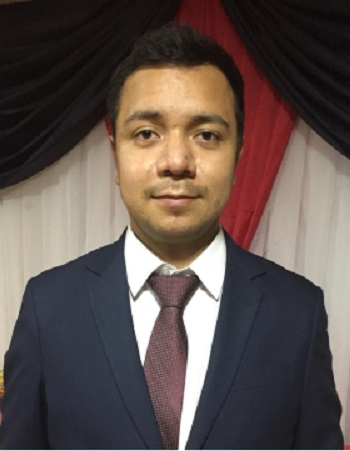

# Backend developer
<!--  -->

I am Andres Fabricio Cordova Cuenca. I am a backend developer and scientist. Currently, I am working on research in the area of electronics and control. I work as a software developer since 2019.

I studied electronics and telecommunications at the University of Cuenca in Ecuador.

I am passionate about software development and everything that this entails. I am a self-taught, responsible and reliable person. One of my main characteristics is the effort I put into the development of my work.